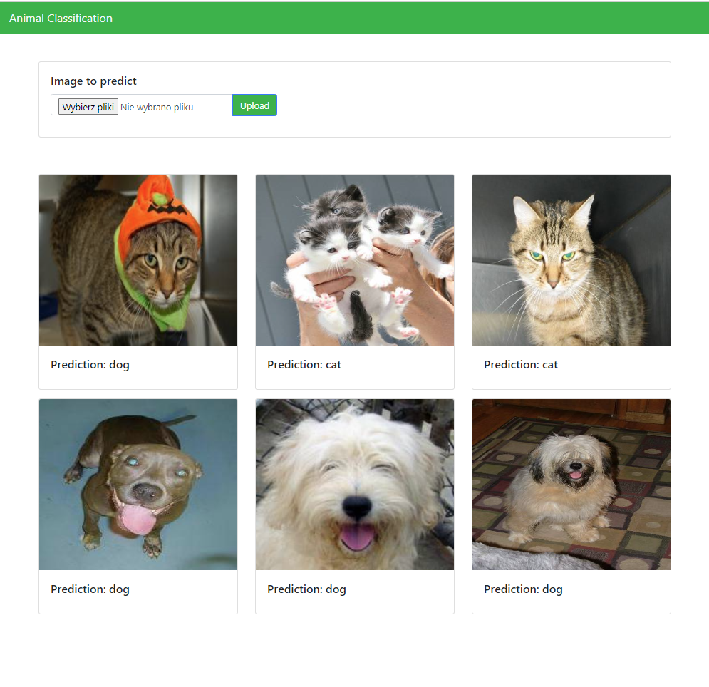
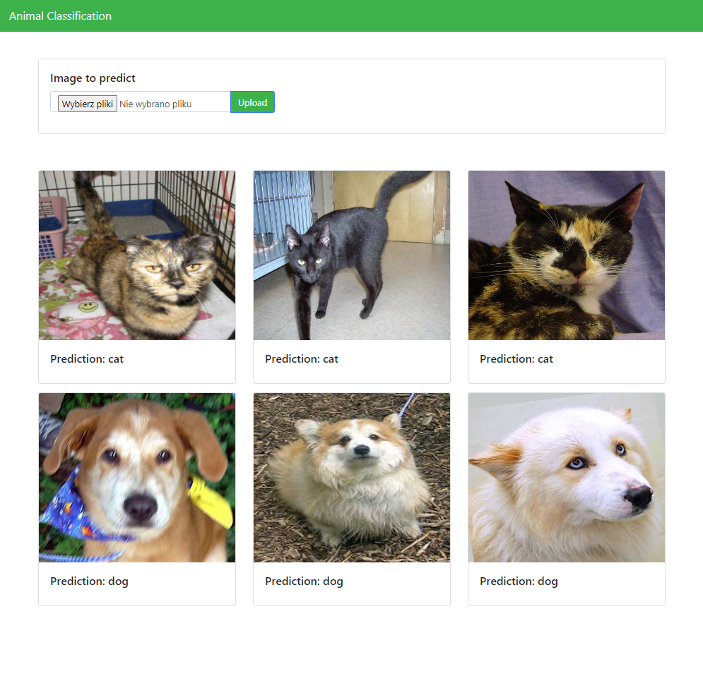

# Animal Classification (Convolutional Neural Network)

The Animal Classification task involves training a Convolutional Neural Network (CNN) model to classify images of animals into different categories. CNNs are particularly well-suited for image classification tasks due to their ability to capture spatial hierarchies and extract relevant features from images.


## Installation

1. Clone the repository:

   ```bash
   git clone https://github.com/jpkrajewski/CNN-animal-classifier.git
   ```

2. Run Docker-Compose

   ```bash
   cd CNN-animal-classifier; docker compose up --build
   ```

3. Go to **localhost:8000**

## Results




